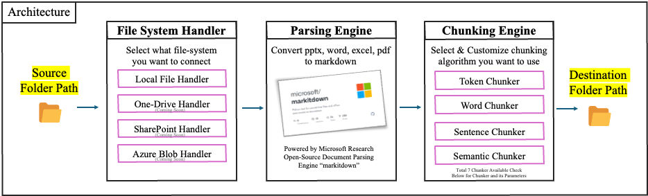

# 🚀 Welcome to OfficeChunker

> [250311 Update] Document Supported : PDF, PPT, Word, Excel  
> [Upcoming Update] OneDrive, Sharepoint will be connected to OfficeChunker

🎉 **OfficeChunker** instantly converts your Microsoft Office documents (Pdf, Word, PowerPoint, Excel) into clear and structured Markdown files. It neatly parses and chunks your files, making them perfect for LLM training, RAG applications, and building knowledge bases—fast and hassle-free! 🚀


### 🌟 Why you'll love OfficeChunker:

- **📂 Easy Folder Processing!** Convert an entire folder of office files into Markdown with just one command. No more tedious one-by-one conversions!
- **🚀 Powered by Microsoft Research's MarkItDown!** Leverage the cutting-edge MarkItDown parsing engine from Microsoft Research for precise and reliable Markdown conversions.
- **🔀 Chunker Type Flexibility!** Choose intuitive chunking methods—token-based, sentence-based, word-based—that best suit your needs.
- **🧙 Per-File-Type Magic!** Apply different chunking strategies for each type of file. Excel needs different treatment from Word? Easy peasy!
- **🎛️ Fine-Tune Your Chunks!** Adjust chunk size and overlaps exactly how you want. No more awkward splits!


### 🎯 What can you do with OfficeChunker?

OfficeChunker is perfect for:

- **🧠 RAG (Retrieval-Augmented Generation)**: Feed clean, organized chunks into your favorite RAG pipeline for smarter, context-rich responses!
- **🤖 LLM Training and Fine-tuning**: Improve your Language Model training workflows by converting noisy office documents into structured, easy-to-process Markdown.
- **📚 Knowledge Base Creation**: Transform company documentation into neatly chunked Markdown files for easy integration with documentation or knowledge management systems.

### 🚀 Quickstart Example:
```bash
pip install officechunker
```

```python
from officechunker.converter import Converter

# Convert an entire folder 
converter = Converter(
    src_folder="./my_docs"
)

converter.convert()
```

You can also use CLI environment. Check below!  
Now you're all set to turn your office files from dull to delightful! 🎊 Happy Chunking!


---

## Table of Contents
- [🚀 Welcome to OfficeChunker](#-welcome-to-officechunker)
    - [🌟 Why you'll love OfficeChunker:](#-why-youll-love-officechunker)
    - [🎯 What can you do with OfficeChunker?](#-what-can-you-do-with-officechunker)
    - [🚀 Quickstart Example:](#-quickstart-example)
  - [Table of Contents](#table-of-contents)
  - [1. Overall Architecture](#1-overall-architecture)
  - [2. Using OfficeChunker in Python Code](#2-using-officechunker-in-python-code)
    - [a. Default Parameters](#a-default-parameters)
    - [b. Single Chunker for All Files](#b-single-chunker-for-all-files)
    - [c. Custom Chunker Mapping](#c-custom-chunker-mapping)
    - [d. Custom Chunker Mapping with Parameters](#d-custom-chunker-mapping-with-parameters)
    - [e. Mixed Chunker Configuration](#e-mixed-chunker-configuration)
  - [3. Using OfficeChunker via the CLI](#3-using-officechunker-via-the-cli)
    - [CLI Options and Arguments](#cli-options-and-arguments)
    - [Example CLI Commands](#example-cli-commands)
      - [a. Basic CLI Command](#a-basic-cli-command)
      - [b. Specifying Destination Folder](#b-specifying-destination-folder)
      - [c. Using a Single Chunker](#c-using-a-single-chunker)
      - [d. Custom Chunker Mapping with JSON](#d-custom-chunker-mapping-with-json)
      - [e. Deleting Temporary Markdown Files After Conversion](#e-deleting-temporary-markdown-files-after-conversion)
  - [4. Supported Chunkers and Parameters](#4-supported-chunkers-and-parameters)
  - [5. Conclusion](#5-conclusion)

---

## 1. Overall Architecture



## 2. Using OfficeChunker in Python Code

OfficeChunker can be directly integrated into your Python projects. Below are various usage examples that cover different scenarios.

### a. Default Parameters

If you do not provide a `chunker_config`, OfficeChunker uses its default conversion settings for all files.

```python
from officechunker.converter import Converter

# Convert files using default parameters.
converter = Converter(
    src_folder="./path_to_source_folder",
    dst_folder="./output_folder"
)
converter.convert()
```

*Explanation:*  
- **src_folder:** The directory containing the files to convert.  
- **dst_folder:** The directory where the Markdown files will be saved.  
- No custom chunker configuration is provided, so default settings are applied.

---

### b. Single Chunker for All Files

To apply the same chunking method (e.g., `"token"`) to every file, pass the chunker as a simple string.

```python
from officechunker.converter import Converter

# Apply the "token" chunker to all files.
converter = Converter(
    src_folder="./path_to_source_folder",
    dst_folder="./output_folder",
    chunker_config="token"
)
converter.convert()
```

*Explanation:*  
- Every file is processed using the `"token"` chunking method.

---

### c. Custom Chunker Mapping

Define different chunking methods for each file extension by supplying a mapping.

```python
from officechunker.converter import Converter

custom_mapping = {
    ".pdf": "token",
    ".docx": "word",
    ".xlsx": "sentence",
    ".pptx": "late",
}

converter = Converter(
    src_folder="./test_dataset_1",
    dst_folder="./test_md_custom_mapping",
    chunker_config=custom_mapping
)
converter.convert()
```

*Explanation:*  
- **.pdf** files will be processed using the `"token"` method.
- **.docx** files will be processed using the `"word"` method.
- **.xlsx** files will use the `"sentence"` method.
- **.pptx** files will use the `"late"` method.

---

### d. Custom Chunker Mapping with Parameters

For additional control, specify not only the chunker type but also parameters like `chunk_size` and `chunk_overlap`.

```python
from officechunker.converter import Converter

custom_mapping = {
    ".pdf": {"type": "token", "params": {"chunk_size": 512}},
    ".docx": {"type": "sentence", "params": {"chunk_overlap": 20}},
    ".xlsx": {"type": "word", "params": {"chunk_size": 256}},
    ".pptx": "late"
}

converter = Converter(
    src_folder="./test_dataset_1",
    dst_folder="./test_md_custom_mapping_params",
    chunker_config=custom_mapping
)
converter.convert()
```

*Explanation:*  
- **.pdf:** Uses `"token"` with a chunk size of 512.
- **.docx:** Uses `"sentence"` with a chunk overlap of 20.
- **.xlsx:** Uses `"word"` with a chunk size of 256.
- **.pptx:** Uses `"late"` without extra parameters.

---

### e. Mixed Chunker Configuration

Mix default settings with custom configurations for specific file types.

```python
from officechunker.converter import Converter

custom_mapping = {
    ".docx": {"type": "sentence", "params": {"chunk_overlap": 100}},
    ".pptx": {"type": "late", "params": {"chunk_size": 512}}
}

converter = Converter(
    src_folder="./test_dataset_1",
    dst_folder="./test_md_mixed",
    chunker_config=custom_mapping
)
converter.convert()
```

*Explanation:*  
- Custom settings are applied only to `.docx` and `.pptx` files.
- Other file types are processed using the library’s default configuration.

---

## 3. Using OfficeChunker via the CLI

OfficeChunker also provides a Command Line Interface (CLI) for users who prefer running conversions directly from the terminal.

### CLI Options and Arguments

When using the CLI, the following options are available:

- **src_folder (required):**  
  Path to the folder containing the files to be converted.

- **--dst_folder (optional):**  
  Destination folder where the converted Markdown files will be saved.  
  *Default:* A folder named `<src_folder>_md` will be created in the current directory if not specified.

- **--chunker_config (optional):**  
  Configuration for the chunker. Accepts either:
  - A single string (e.g., `"token"`) to apply the same chunker to all files, or
  - A JSON-formatted dictionary mapping file extensions to chunker settings.

  *Example JSON:*
  ```json
  {
      ".pdf": {"type": "token", "params": {"chunk_size": 512}},
      ".docx": {"type": "sentence", "params": {"chunk_overlap": 20}},
      ".xlsx": {"type": "word", "params": {"chunk_size": 256}},
      ".pptx": "late"
  }
  ```
  **Note:** Ensure the JSON string is properly escaped when passing it as a command line argument.

- **--delete_md_files (optional):**  
  If set, this flag deletes the temporary Markdown (`.md`) files after conversion.

---


### Example CLI Commands  
> Download the officechunker before u use the CLI Commands
```bash
pip install officechunker
```

#### a. Basic CLI Command  

Convert files using default settings:  

```bash
officechunker /path/to/source_folder
```

#### b. Specifying Destination Folder  

```bash
officechunker /path/to/source_folder --dst_folder /path/to/output_folder
```

#### c. Using a Single Chunker  

```bash
officechunker /path/to/source_folder --chunker_config "token"
```

#### d. Custom Chunker Mapping with JSON  

```bash
officechunker /path/to/source_folder \
    --dst_folder /path/to/output_folder \
    --chunker_config '{"pdf": {"type": "token", "params": {"chunk_size": 512}}, "docx": {"type": "sentence", "params": {"chunk_overlap": 20}}}'
```

#### e. Deleting Temporary Markdown Files After Conversion  

```bash
officechunker /path/to/source_folder \
    --dst_folder /path/to/output_folder \
    --delete_md_files
```


---


## 4. Supported Chunkers and Parameters

Here's a detailed **English** table summarizing all available chunkers in **OfficeChunker**, their descriptions, and all associated parameters:  

| Chunker Type | Description                                             | Parameter Details |
|--------------|---------------------------------------------------------|-------------------|
| **token**    | Chunks text based on tokens counted by a tokenizer. Ideal for precise token-based splitting. | `tokenizer` (default: `gpt2`) <br>`chunk_size` (default: 1024)<br>`chunk_overlap` (default: 30)<br>`return_type` (default: `chunks`) |
| **word**     | Chunks text based on word count, using tokenizer or a custom token counter. | `tokenizer_or_token_counter` (default: `gpt2`)<br>`chunk_size` (default: 512)<br>`chunk_overlap` (default: 30)<br>`return_type` (default: `chunks`) |
| **sentence** | Chunks text naturally at sentence boundaries defined by delimiters (e.g., `.`, `?`, `!`, `\n`). | `tokenizer_or_token_counter` (default: `gpt2`)<br>`chunk_size` (default: 512)<br>`chunk_overlap` (default: 30)<br>`min_sentences_per_chunk` (default: 1)<br>`min_characters_per_sentence` (default: 12)<br>`approximate` (default: True)<br>`delim` (default: `[., ?, !, \n]`)<br>`include_delim` (default: `prev`)<br>`return_type` (default: `chunks`) |
| **recursive**| Recursively splits long text into hierarchical chunks, using recursive splitting rules. | `tokenizer_or_token_counter` (default: `gpt2`)<br>`chunk_size` (default: 512)<br>`rules` (default: `RecursiveRules()`)<br>`min_characters_per_chunk` (default: 12)<br>`return_type` (default: `chunks`) |
| **semantic** | Groups sentences into chunks based on semantic similarity (uses embeddings). | `embedding_model` (default: `minishlab/potion-base-8M`)<br>`mode` (default: `window`)<br>`threshold` (default: `auto`)<br>`chunk_size` (default: 512)<br>`similarity_window` (default: 1)<br>`min_sentences` (default: 1)<br>`min_characters_per_sentence` (default: 12)<br>`min_chunk_size` (default: 2)<br>`threshold_step` (default: 0.01)<br>`delim` (default: `[., !, ?, \n]`)<br>`return_type` (default: `chunks`) |
| **sdpm**     | Semantic Discourse Parsing Model, creates chunks based on discourse and semantic relevance. | `embedding_model` (default: `minishlab/potion-base-8M`)<br>`threshold` (default: 0.5)<br>`chunk_size` (default: 512)<br>`min_sentences` (default: 1)<br>`skip_window` (default: 1) |
| **late**     | Latent topic embedding-based chunking, groups sentences based on inferred latent topics. | `embedding_model` (default: `all-MiniLM-L6-v2`)<br>`mode` (default: `sentence`)<br>`chunk_size` (default: 512)<br>`min_sentences_per_chunk` (default: 1)<br>`min_characters_per_sentence` (default: 12) |

---


## 5. Conclusion

OfficeChunker offers a flexible framework for converting document files into Markdown with various chunking options. Whether you integrate it into your Python project or use the CLI for quick conversions, you can easily configure:

- **Basic Usage** with default settings,
- **Uniform Processing** using a single chunker,
- **Custom Mappings** for file extension-specific control,
- **Advanced Configurations** with custom parameters, and
- **Mixed Configurations** that combine default and custom settings.

This versatility allows OfficeChunker to adapt seamlessly to a wide range of workflows and document processing requirements.
